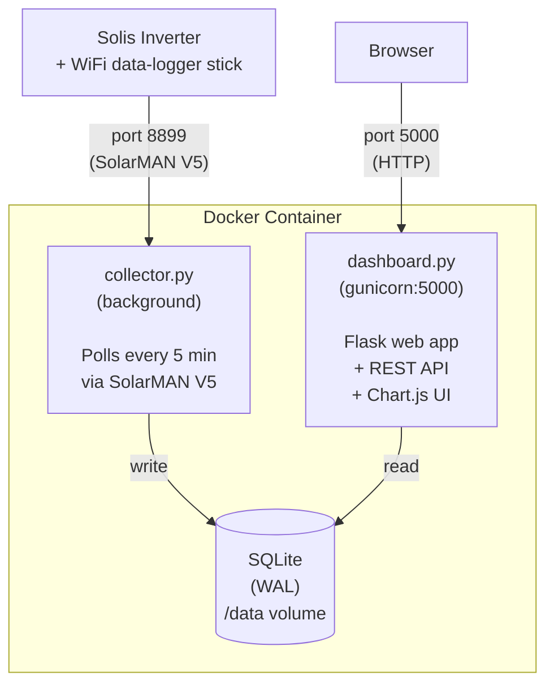

# Solis Ginlong Local Monitor

A lightweight, self-hosted monitoring solution for Solis (Ginlong) inverters. Runs on a Raspberry Pi with Docker, polls your inverter over the local network using the SolarMAN V5 protocol, stores historical data in SQLite, and serves a real-time web dashboard.

<!-- screenshot placeholder:  -->

## Features

- **Real-time metrics** -- current power, PV voltage/current, grid voltage, frequency, temperature
- **Historical charts** -- power output, daily energy generation, voltage and temperature trends
- **Time range controls** -- today, 7 days, 30 days, or custom date range
- **Dark theme dashboard** -- clean, responsive UI built with Chart.js
- **Lightweight** -- single Docker container, SQLite storage, no cloud dependencies
- **Configurable** -- all settings via environment variables / `.env` file

## Inverter Compatibility

This has been tested **only** on:

- **Solis-mini-2000-4G** (single-phase, single-string)
- WiFi data-logger stick using the **SolarMAN V5** protocol on port 8899

It may work with other Solis inverters that use the same register map and SolarMAN-compatible data loggers, but this is not guaranteed. Contributions for other models are welcome.

> **Note:** Standard Modbus TCP/RTU does **not** work on port 8899. The SolarMAN V5 protocol wraps Modbus frames in its own packet format. This project uses the [`pysolarmanv5`](https://github.com/jmccrohan/pysolarmanv5) library to handle this.

## Prerequisites

- **Raspberry Pi** (or any Linux host) with Docker and Docker Compose installed
- **Solis inverter** with a SolarMAN-compatible WiFi data-logger stick
- The Pi must be able to reach the inverter's IP address on port 8899 (see [Network Notes](#network-notes))

## Quick Start

```bash
# 1. Clone the repository
git clone https://github.com/YOUR_USERNAME/solis-ginlong-local-monitor.git
cd solis-ginlong-local-monitor

# 2. Create your .env file from the example
cp .env.example .env

# 3. Edit .env -- set your inverter IP and logger serial number (REQUIRED)
nano .env

# 4. Build and start
docker compose up -d --build

# 5. Open the dashboard
#    http://<your-pi-ip>:5000
```

To stop:

```bash
docker compose down
```

Your data is persisted in a Docker volume (`solar-data`) and survives container restarts.

## Configuration

All settings are controlled via environment variables. Copy `.env.example` to `.env` and edit as needed.

| Variable | Required | Default | Description |
|----------|----------|---------|-------------|
| `INVERTER_IP` | **Yes** | -- | IP address of the inverter / data-logger stick |
| `LOGGER_SERIAL` | **Yes** | -- | Serial number printed on the data-logger stick |
| `MODBUS_PORT` | No | `8899` | SolarMAN V5 port |
| `SLAVE_ID` | No | `1` | Modbus slave ID |
| `POLL_INTERVAL` | No | `300` | Polling interval in seconds (5 min) |
| `WEB_PORT` | No | `5000` | Dashboard web server port |
| `DB_FILENAME` | No | `solar_data.db` | SQLite database filename |
| `TZ` | No | `UTC` | Timezone (e.g. `Europe/London`) |

### Finding Your Logger Serial Number

The serial number is printed on the SolarMAN WiFi data-logger stick itself (the small device plugged into your inverter). It's typically a 10-digit number, e.g. `1234567890`.

## Architecture



- **collector.py** -- background process that reads Modbus registers via `pysolarmanv5`, writes to SQLite
- **dashboard.py** -- Flask app serving the HTML dashboard and JSON API endpoints
- **config.py** -- shared configuration module; reads all settings from environment variables
- **start.sh** -- entrypoint that launches both processes inside the container

## API Endpoints

| Endpoint | Description |
|----------|-------------|
| `GET /` | Dashboard UI |
| `GET /api/live` | Latest reading (JSON) |
| `GET /api/today` | All readings for today |
| `GET /api/history?start=YYYY-MM-DD&end=YYYY-MM-DD&resolution=raw\|hourly\|daily` | Historical readings |
| `GET /api/daily_summary?days=30` | Daily energy totals |
| `GET /api/stats` | Aggregate statistics |

## Troubleshooting

**Container starts but no data appears:**
- Check that `INVERTER_IP` and `LOGGER_SERIAL` are set correctly in `.env`
- The first collection cycle may fail at startup if the network isn't ready; it will recover on the next cycle (5 min)
- Check logs: `docker compose logs -f`

**Connection refused / timeout:**
- Verify the Pi can reach the inverter: `ping <INVERTER_IP>`
- Verify port 8899 is open: `nc -zv <INVERTER_IP> 8899`
- If on different subnets, ensure inter-VLAN routing is configured

**All values are zero at night:**
- This is normal. The inverter only generates power during daylight hours. The dashboard will show historical data.

**Register mapping looks wrong:**
- The Solis single-phase register map has a quirk: AC voltage is at register 3035 ("Phase B") and AC current at 3038 ("Phase C"). These are the correct registers for single-phase models.

## License

[MIT](LICENSE)
